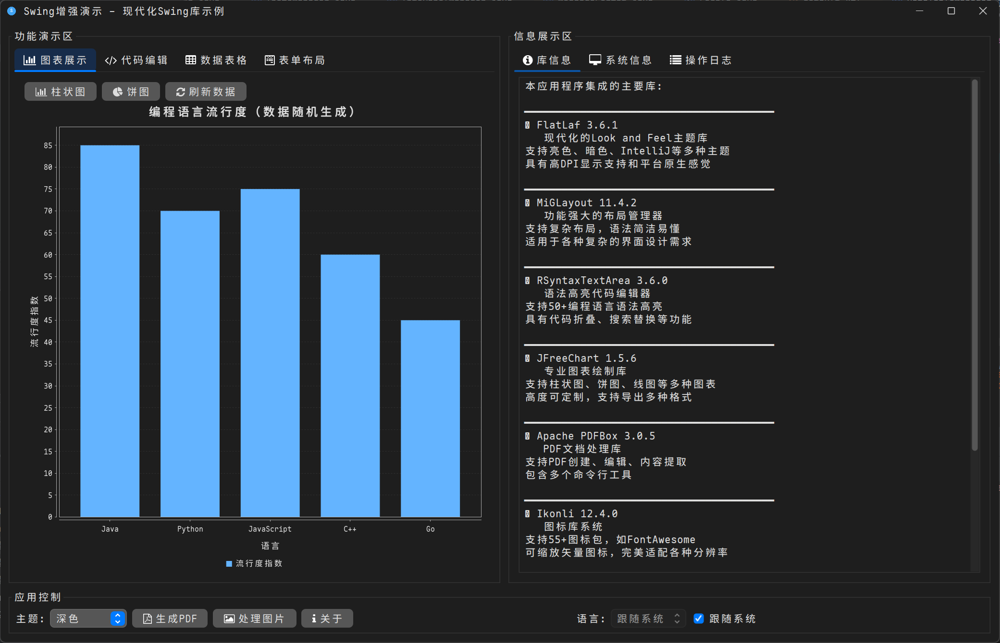
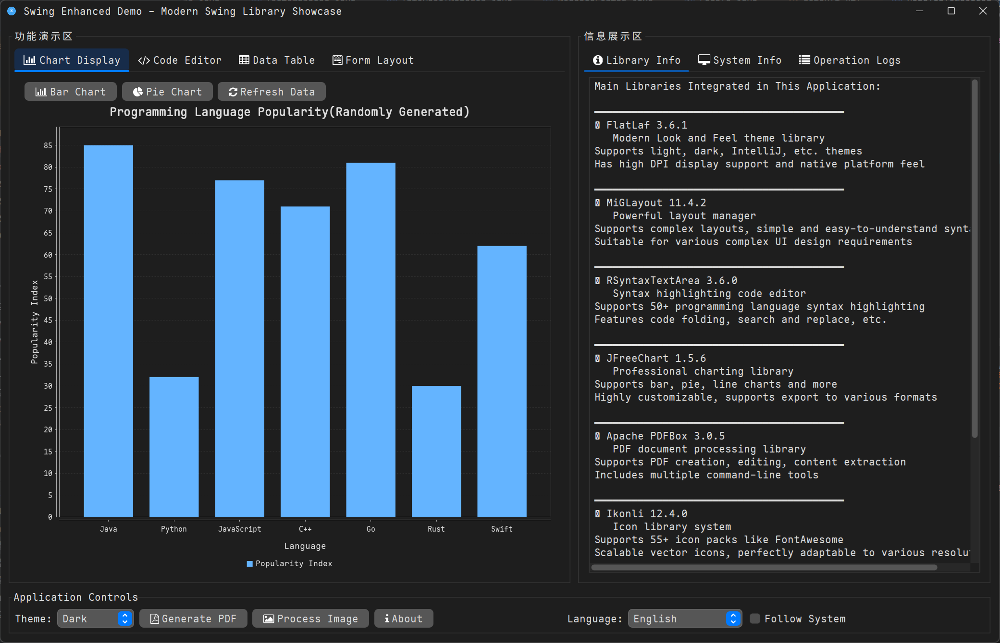
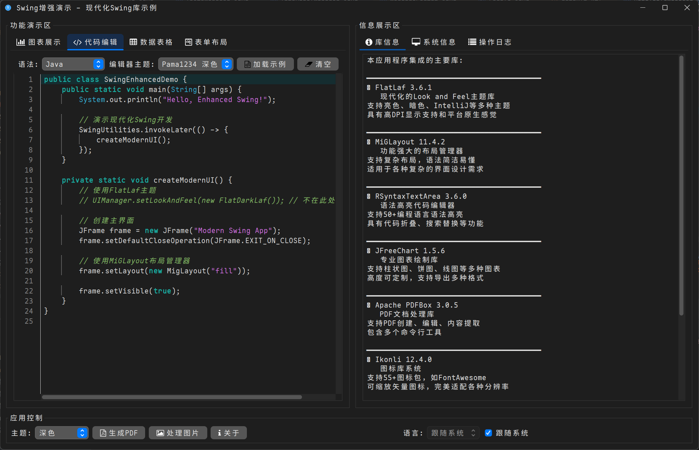
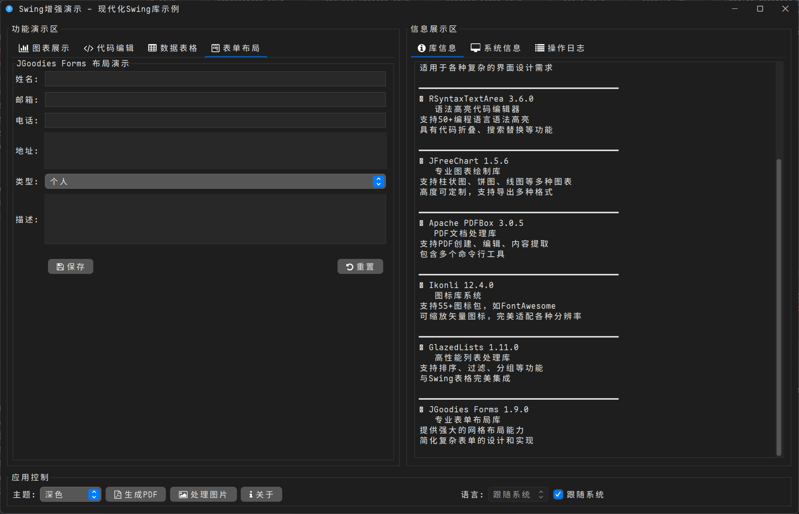
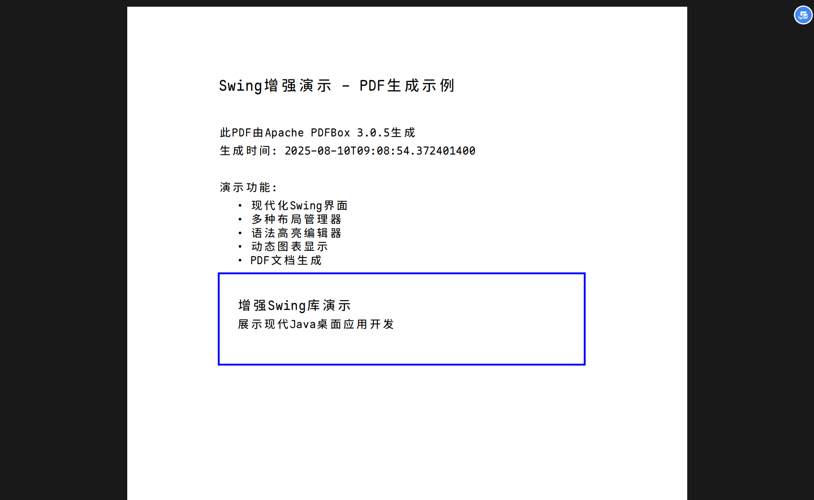
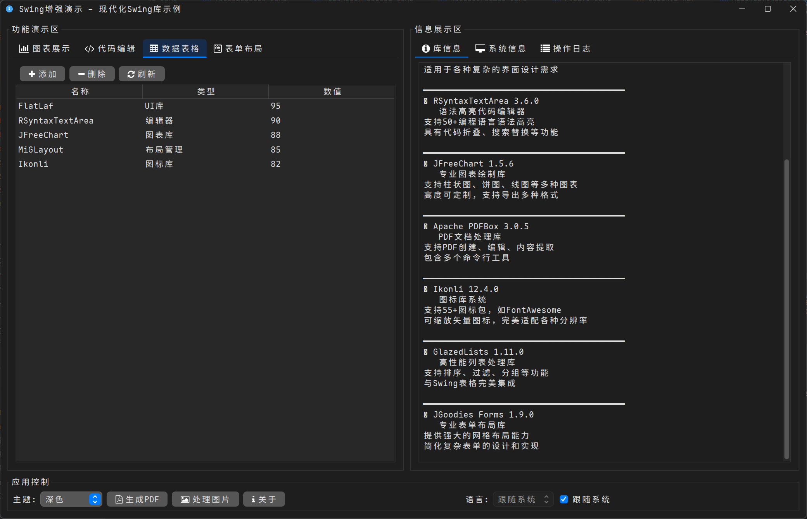

# Swing Enhanced Demo

A modern Java Swing enhanced library demonstration application, showcasing how multiple powerful third-party libraries can elevate the user experience and development efficiency of Swing applications.


[中文版 / Chinese Version](README.md)

## 📸 Application Screenshots

<div align="center">

| Chart Features | Chart Features (English) |
|:---:|:---:|
|  |  |

| Code Editor | Form Layout |
|:---:|:---:|
|  |  |

| PDF Generation | Data Table |
|:---:|:---:|
|  |  |

</div>

## 🌟 Key Features

### 🎨 Modern Interface
-   **FlatLaf Theme System**: Supports various modern themes like Light, Dark, IntelliJ, Darcula.
-   **System Theme Detection**: Automatically detects and adapts to the system's light/dark mode.
-   **High DPI Support**: Perfectly adapts to high-resolution displays.
-   **Vector Icons**: Utilizes FontAwesome icons provided by Ikonli, supporting arbitrary scaling.
-   **System Tray Integration**: Application can be minimized to the system tray, offering convenient menu operations (e.g., show/hide window, exit).

### 💻 Code Editor
-   **Syntax Highlighting**: Supports 50+ programming languages including Java, Python, JavaScript, HTML, CSS.
-   **Code Folding**: Intelligent code folding and expansion.
-   **Theme Switching**: Editor theme is linked with the application theme.
-   **Auto-completion**: Smart features like bracket matching and auto-indentation.

### 📊 Chart Display
-   **Dynamic Charts**: Supports various chart types like bar charts and pie charts.
-   **Real-time Updates**: Charts automatically refresh when data changes.
-   **Customizable Styles**: Chart colors and styles can be customized.
-   **Export Functionality**: Supports exporting to PNG, JPEG, and other formats.

### 🔧 Layout Management
-   **MiGLayout**: A powerful and concise layout manager.
-   **JGoodies Forms**: A professional solution for form layouts.
-   **Responsive Design**: UI adapts to different window sizes.

### 📋 Data Management
-   **GlazedLists**: High-performance list operations, supporting sorting, filtering, and grouping.
-   **Table Display**: Seamlessly integrated with Swing JTable.
-   **Data Binding**: Data changes are reflected in the UI in real-time.

### 📄 Document Processing
-   **PDF Generation**: Create and edit PDF documents using Apache PDFBox.
-   **Image Processing**: Thumbnailator provides image resizing, rotation, and other functionalities.
-   **HTML Rendering**: LoboEvolution provides support for rendering HTML content.

## 🚀 Quick Start

### Requirements

-   **Java 8+** (Java 17+ recommended)
-   **Maven 3.6+** or **Gradle 7.0+**
-   **IDE**: IntelliJ IDEA, Eclipse, or any IDE supporting Maven/Gradle

### Clone the Project

```bash
git clone https://github.com/UniverseEmbedded/swing-enhanced-demo.git
cd swing-enhanced-demo
```

### Build and Run

#### Using Maven
```bash
# Compile the project
mvn clean compile

# Run the application
mvn exec:java -Dexec.mainClass="pama1234.dstar.Main"

# Package into an executable JAR
mvn clean package
java -jar target/swing-enhanced-demo-1.0-SNAPSHOT.jar
```

#### Using Gradle
```bash
# Compile the project
./gradlew build

# Run the application
./gradlew run

# Create distribution package
./gradlew distZip
```

### Add Custom Fonts (Optional)

1.  Place your font file in the `src/main/resources/fonts/` directory.
2.  Ensure the font file is named `MapleMonoNormal-NF-CN-Regular.ttf`.
3.  If no custom font is added, the application will use the system's default font.

## 📦 Dependency Libraries

| Library Name         | Version | Description                      | Official Website                                         |
| -------------------- | ------- | -------------------------------- | -------------------------------------------------------- |
| FlatLaf              | 3.6.1   | Modern Look and Feel             | [formdev.com/flatlaf](https://www.formdev.com/flatlaf/)  |
| Ikonli               | 12.4.0  | Icon Library System              | [kordamp.org/ikonli](https://kordamp.org/ikonli/)        |
| MiGLayout            | 11.4.2  | Layout Manager                   | [miglayout.com](http://www.miglayout.com/)               |
| JGoodies Forms       | 1.9.0   | Form Layout                      | [jgoodies.com](https://www.jgoodies.com/freeware/libraries/forms/) |
| RSyntaxTextArea      | 3.6.0   | Syntax Highlighting Editor       | [bobbylight.github.io/RSyntaxTextArea](https://bobbylight.github.io/RSyntaxTextArea/) |
| JFreeChart           | 1.5.6   | Chart Drawing Library            | [jfree.org/jfreechart](https://www.jfree.org/jfreechart/) |
| Apache PDFBox        | 3.0.5   | PDF Processing Library           | [pdfbox.apache.org](https://pdfbox.apache.org/)          |
| GlazedLists         | 1.11.0  | List Operation Library           | [glazedlists.dev.java.net](http://glazedlists.dev.java.net/) |
| Thumbnailator        | 0.4.20  | Image Processing Library         | [github.com/coobird/thumbnailator](https://github.com/coobird/thumbnailator) |
| jSystemThemeDetector | 3.6     | System Theme Detection           | [github.com/Dansoftowner/jSystemThemeDetector](https://github.com/Dansoftowner/jSystemThemeDetector) |

## 📱 Feature Details

### Main Interface
-   🖥️ Modern multi-panel layout
-   🎨 Supports light and dark theme switching
-   📊 Real-time chart display
-   💻 Syntax highlighting code editing

### System Tray Menu
-   🖱️ The application can be minimized to the system tray, and a menu can be popped up by right-clicking the tray icon.
-   👁️ Menu options include "Show Window", "Settings", and "Exit Application" for quick operations.
-   💬 Tray icon tooltip text supports multi-language switching.

### Featured Functionality
-   📈 **Dynamic Charts**: Bar and pie chart switching, real-time data updates.
-   🔤 **Code Editing**: Syntax highlighting for 50+ languages, intelligent code folding.
-   📋 **Data Table**: High-performance list operations, supporting add, delete, and refresh.
-   📝 **Form Layout**: JGoodies Forms professional form demonstration.
-   ℹ️ **Information Display**: Library info, system info, operation logs.

## 🛠️ Development Guide

### Adding New Features

1.  **Add a new demo panel**:
    ```java
    private static JPanel createNewDemoPanel() {
        JPanel panel = new JPanel(new MigLayout("fill"));
        // Add components...
        return panel;
    }
    ```

2.  **Integrate new libraries**:
  -   Add dependencies in `build.gradle`.
  -   Add feature demonstrations in the corresponding demo panels.
  -   Update documentation and README.

3.  **Custom themes**:
    ```java
    // Add new theme in ThemeManager's applySelectedTheme method
    case "CustomTheme":
        UIManager.setLookAndFeel(new CustomLookAndFeel());
        break;
    ```

4.  **Internationalization Support**:
  -   Add new key-value pairs in `src/main/resources/messages_en.properties` and `messages_zh_CN.properties`.
  -   Use `Main.getLanguageManager().getString("your.key")` in your code to fetch localized text.

### Debugging Tips

1.  **Enable detailed logging**:
    ```bash
    java -Djava.util.logging.level=FINE -jar your-app.jar
    ```

2.  **Font issue debugging**:
  -   Check font file path (`src/main/resources/fonts/MapleMonoNormal-NF-CN-Regular.ttf`).
  -   Verify font file format.
  -   Check console for font loading information.

3.  **Theme issues**:
  -   Ensure FlatLaf version compatibility.
  -   Check UIManager settings.
  -   Verify component update calls.

4.  **Tray icon issues**:
  -   Confirm system support for `SystemTray.isSupported()`.
  -   Check if the application icon (`createAppIcon()`) is generated correctly.
  -   Verify the application appears in the task manager or system tray settings.

## 🎯 Use Cases

### Learning Purposes
-   **Swing Development Learning**: Understand modern Swing development best practices.
-   **Library Integration Reference**: Learn how to integrate multiple third-party libraries.
-   **UI Design Inspiration**: Reference for modern UI design.

### Project Foundation
-   **Desktop Application Development**: As a starting template for new projects.
-   **Prototype Development**: Quickly create functional prototypes.
-   **Technology Demonstration**: Showcase technical capabilities to clients or teams.

### Educational Use
-   **Programming Instruction**: Java GUI programming teaching material.
-   **Library Feature Demonstration**: Showcase the functions and usages of various libraries.
-   **Best Practice Examples**: Code organization and architecture reference.

## 🤝 Contributing Guide

We welcome contributions in all forms!

### How to Contribute

1.  **Fork the project**.
2.  **Create your feature branch** (`git checkout -b feature/AmazingFeature`).
3.  **Commit your changes** (`git commit -m 'Add some AmazingFeature'`).
4.  **Push to the branch** (`git push origin feature/AmazingFeature`).
5.  **Open a Pull Request**.

### Types of Contributions

-   🐛 **Bug Fixes**: Resolve known issues.
-   ✨ **New Features**: Add new demonstration functionalities.
-   📚 **Documentation**: Improve documentation and comments.
-   🎨 **UI/UX**: Enhance UI/UX design.
-   ⚡ **Performance**: Optimize performance.
-   🧪 **Testing**: Add or improve tests.

## 📄 License

This project is licensed under the MIT License - see the [LICENSE](LICENSE) file for details.

## 🙏 Acknowledgements

Thanks to the contributions of the following open-source projects and communities:

-   [FlatLaf](https://www.formdev.com/flatlaf/) - Modern Look and Feel
-   [RSyntaxTextArea](https://bobbylight.github.io/RSyntaxTextArea/) - Syntax Highlighting Editor
-   [JFreeChart](https://www.jfree.org/jfreechart/) - Chart Library
-   [Apache PDFBox](https://pdfbox.apache.org/) - PDF Processing
-   [MiGLayout](http://www.miglayout.com/) - Layout Manager
-   And all other excellent open-source library authors!

## 📞 Contact Information

-   **Author**: pama1234
-   **Email**: pama1234@163.com
-   **Project Homepage**: [GitHub Repository](https://github.com/UniverseEmbedded/swing-enhanced-demo)
-   **Issue Tracker**: [GitHub Issues](https://github.com/UniverseEmbedded/swing-enhanced-demo/issues)

---

⭐ If this project helps you, please give it a star!

💡 For any suggestions or questions, feel free to submit an Issue or Pull Request!